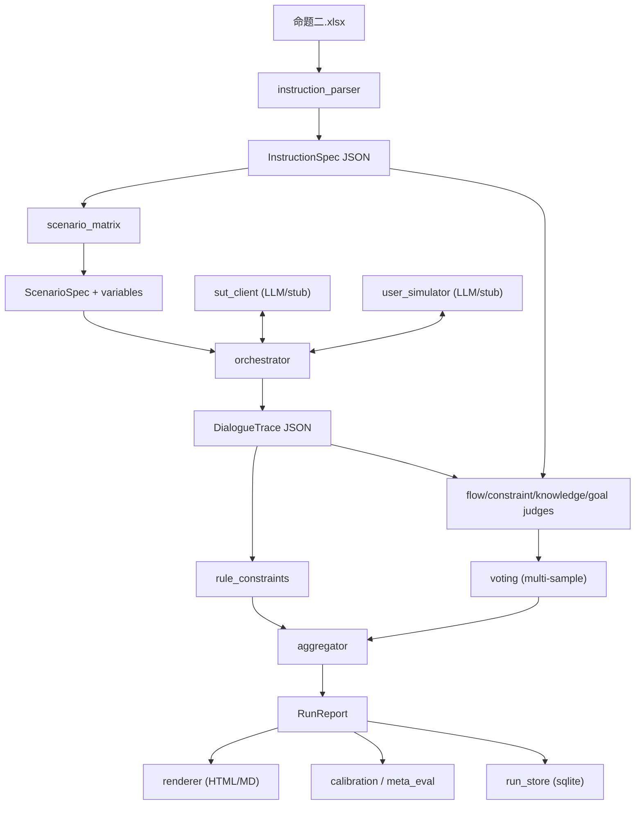

# 设计文档：复杂指令多轮对话评测系统

## 1. 评测目标

在履约数字人外呼场景里，对话模型需要严格遵守一份复杂指令，包括：

- 流程节点和分支条件；
- FAQ 知识点；
- 硬约束（字数上限、禁用词、开场白关键短语、不承诺折扣等）；
- 软约束（语气、避免重复、过渡语等）；
- 终止策略（在用户拒绝、忙碌、越权问题等场景下应有特定行为）。

人工评估代价高，难以量化。本系统的目标是：

- **可解释**：每条扣分都能映射到具体规则、对话轮次、原文片段；
- **可量化**：把指令遵循效果汇总成 8 维分数 + 加权总分 + 置信区间；
- **可靠**：LLM Judge 必须经过结构化输出 + 多采样投票 + 人工校准；
- **可复现**：每次 run 记录全部输入、模型、随机种子，便于事后重放与对比。

## 2. 总体数据流

## 3. 模块职责

### 3.1 `src/core/instruction_parser.py`

- 用 openpyxl 读取 Excel，跳过空行；
- 用正则把 Markdown 切分成 Role/Task/Opening Line/Call Flow/Knowledge/Constraints；
- 调用 LLM 把 Call Flow 解析成有向图，把约束解析成机器可读规则；
- 失败或无 API 时回退到纯启发式 offline 解析；
- 输出 `data/instructions/<id>.json` 与 `<id>.md` 副本。

### 3.2 `src/core/scenario_matrix.py`

- 读取 `configs/personas.yaml` 中的 8 种画像模板；
- 为每条指令裁剪出适用的场景（如指令未规定越权话术则跳过该场景）；
- 将变量（rider_name 等）从池中抽样填入；
- 输出 `ScenarioSpec` 列表，每个都标注 `target_nodes` 和 `target_constraints`，避免在评估阶段把"该场景不该走的分支"当作漏项。

### 3.3 用户模拟器与 SUT

- `user_simulator.py`：模拟器只拿到 `behaviour` 简介与角色提示，**不**接触指令原文，避免泄露答案；
- `sut_client.py`：被测模型拿到完整指令的 Markdown 作为 system prompt，并替换 `${var}` 占位；
- 双方都提供 LLM 实现 + 离线 stub，便于无 API 的演示；
- `orchestrator.py`：双 LLM 交替；终止条件包括 `[END_CALL]`、SUT 告别、最大轮数、连续无效回复；trace 全程持久化。

### 3.4 评估器栈

- 规则评估（`rule_constraints.py`）：字数 / 禁用词 / 不承诺 / 开场白 / 越权兜底 / 强制话术 / 终止策略；
- LLM Judge：
  - `flow_judge.py`：PCR + BCA；
  - `knowledge_judge.py`：KAR；
  - `constraint_judge.py`：SCR；
  - `goal_judge.py`：GSR；
- `voting.py`：每个语义 judge 多采样 N 次，多数投票决 passed，得分取均值，置信度由方差与一致率派生；
- `aggregator.py`：合成 8 维 DimensionScore、加权总分、bootstrap CI、失败归因 Top-K；
- `calibration.py`：与人工标注做一致率与 Cohen's kappa。

### 3.5 报告与持久化

- `report/renderer.py`：单文件 HTML + Markdown，HTML 内嵌 Plotly CDN 雷达图；trace 每轮气泡，违规标注右侧；失败归因表显示扣分排序。
- `core/run_store.py`：SQLite 数据库，索引每个 run 与 case，便于 Web UI 与 A/B 对比。

## 4. 评测可靠性设计

- **结构化输出**：所有 LLM Judge 通过 `response_format=json_object` 强制 JSON，pydantic 校验失败重试。
- **多采样投票**：相同 prompt 用不同 seed 跑 N 次，取得分均值与一致率，置信度 = 1 − 方差。
- **缓存**：同 prompt 命中磁盘缓存，避免重复 token 成本；可在 `configs/default.yaml` 调整 `runtime.cache_dir`。
- **校准集**：`data/calibration/<case_id>.json` 存人工标签，`meta_eval` CLI 输出每个维度的 accuracy 与 kappa。
- **bootstrap CI**：基于 case 总分重采样 200 次，输出 95% 置信区间。

## 5. 关键决策

- **不让 user-sim 接触指令**：避免它"按答案配合"。模拟器只拿到 `behaviour` 简介。
- **PCR 仅评估 target_nodes**：复杂指令含分支，未触发的分支不应被算成漏项。
- **规则与 LLM 解耦**：能用代码算的（字数、禁用词、开场白、终止）一律走规则；只有需要语言理解的（路径覆盖、知识准确、语气）走 judge，降低噪声。
- **失败归因**：每条扣分都映射回 `criterion_id × turn_ids × evidence × rationale`，让报告读者能直接定位问题。

## 6. 扩展点

- 新指令格式：在 `instruction_parser.SECTION_HEADERS` 增加正则即可；离线启发式也会自动套用。
- 新场景：在 `configs/personas.yaml` 新增条目，并在 `scenario_matrix._select_target_nodes` 中处理 hint。
- 新维度：在 `configs/metrics.yaml` 与 `aggregator.DEFAULT_WEIGHTS` 注册，写一个新的 evaluator，加入 `evaluate_case`。
- 新 SUT/UserSim 后端：实现 `SUTClient` / `UserSimulator` Protocol 即可。
