<style>
code { color: #1d4ed8; background: none; padding: 0; }
pre code { color: #1e293b; }
</style>

<h1 style="color:#1e40af;font-weight:bold;">复杂指令下的多轮对话评测系统参赛文档</h1>

**Complex Instruction Dialogue Evaluation System（CIDES）**

<h2 style="color:#1e40af;font-weight:bold;">一、项目背景与赛题理解</h2>

### 1.1 任务背景

在履约数字人外呼场景中，系统需要自动发起与用户的通话，并要求对话模型严格按照预设任务指令推进业务流程。此类任务指令通常包含明确的开场白、业务目标、流程分支、FAQ 知识点、硬性约束、软性表达要求以及不同用户状态下的终止策略。

传统人工评测方式存在成本高、覆盖不足、结论主观、难以复现等问题。尤其在复杂指令和多轮对话条件下，模型是否真正遵循了任务流程、是否遗漏关键节点、是否在用户追问或诱导下违反约束，往往需要逐轮阅读对话才能判断，难以形成稳定、可量化的评估能力。

本项目围绕“复杂指令下的多轮对话评测系统”赛题，构建了一套面向外呼任务的自动化评测方案，英文项目名称为 **Complex Instruction Dialogue Evaluation System**，缩写为 **CIDES**。系统通过用户模拟器主动生成多类型测试对话，再结合规则评估、LLM Judge、多采样投票、失败归因和可视化报告，实现对对话模型指令遵循效果的自动化、可解释、可量化评估。

### 1.2 赛题痛点

本赛题的核心难点不只是“给对话打分”，而是要在复杂任务指令下判断模型是否稳定完成任务。

首先，外呼任务指令通常具有流程性。模型不仅要说对内容，还要按正确顺序推进，不能跳步、漏步或提前泄露后续节点。

其次，真实用户行为具有不确定性。用户可能配合，也可能犹豫、抗拒、追问细节、提出越权问题、打断对话、表示正在开车，甚至诱导模型承诺优惠或跳过规则。单一静态样本无法充分检验模型的鲁棒性。

再次，评测结果必须可解释。比赛要求自动产出评测报告，因此系统不能只给一个总分，还需要说明每一项扣分来自哪条规则、哪一轮对话、哪段原文证据以及为什么扣分。

最后，评测结果需要可靠。LLM Judge 本身可能存在波动，因此系统需要通过结构化输出、规则评估、多采样投票、置信度和人工校准等机制降低误判风险。

### 1.3 建设目标

本项目围绕两个交付目标展开：

一是构建用户模拟器。系统能够基于任务指令自动构造多类用户场景，驱动被测对话模型进行多轮交互，从而充分测试模型在不同用户状态、不同流程分支和不同风险场景下的指令遵循能力。

二是自动产出评测报告。系统能够对每个 Case 独立判定通过或失败，输出八个维度的量化分数、加权总分、通过率、置信区间、失败归因和逐轮对话证据，并支持 Web UI 中的一键复盘。

在此基础上，CIDES 进一步提供 **生成对话** 与 **真实对话** 两类评测入口：前者用于主动构造测试样本，后者用于对脱敏真实通话进行自动质检，两条链路共享同一套八维评测体系与报告能力。

<h2 style="color:#1e40af;font-weight:bold;">二、系统总体方案</h2>

### 2.1 系统设计思路

系统采用“指令结构化解析 + 场景矩阵生成 + 用户模拟对话 + 多维自动评测 + 可解释报告”的整体思路。

首先，系统将原始外呼任务指令解析为结构化的 `InstructionSpec`，包括任务角色、业务目标、开场白模板、变量占位符、流程节点、流程边、FAQ 知识点、硬约束、软约束和终止策略。

然后，系统根据指令内容和预设用户画像生成 `ScenarioSpec` 场景矩阵。每个场景明确用户目标、行为模式、应覆盖的流程节点、应触发的约束和预期终止方式，保证评测范围可控且可复现。

接着，`orchestrator` 负责驱动被测模型 SUT 与用户模拟器 UserSim 进行多轮对话。SUT 接收完整任务指令和当前场景执行指引，UserSim 只接收用户画像和行为约定，不接触任务答案，避免模拟器“配合式通关”。

最后，系统对 `DialogueTrace` 进行自动评估，产出 `CaseReport` 和 `RunReport`。报告既包含分数，也包含逐条扣分证据和失败原因。

从评测数据来源看，系统支持两条并行链路：

- **生成对话评测**：由用户模拟器与 SUT 自动进行多轮交互，主动覆盖多种用户场景，适合模型上线前压测、Prompt 迭代和回归测试。
- **真实对话评测**：用户上传脱敏真实通话 JSON，系统跳过对话生成阶段，直接对已有 trace 评分，适合业务质检、样本复盘和真实表现验证。

两条链路在“对话轨迹落盘 → 八维自动评测 → 报告生成 → Web UI 复盘”之后完全收敛，保证评测标准一致、结果可对比。

### 2.2 整体流程

系统整体流程如下：

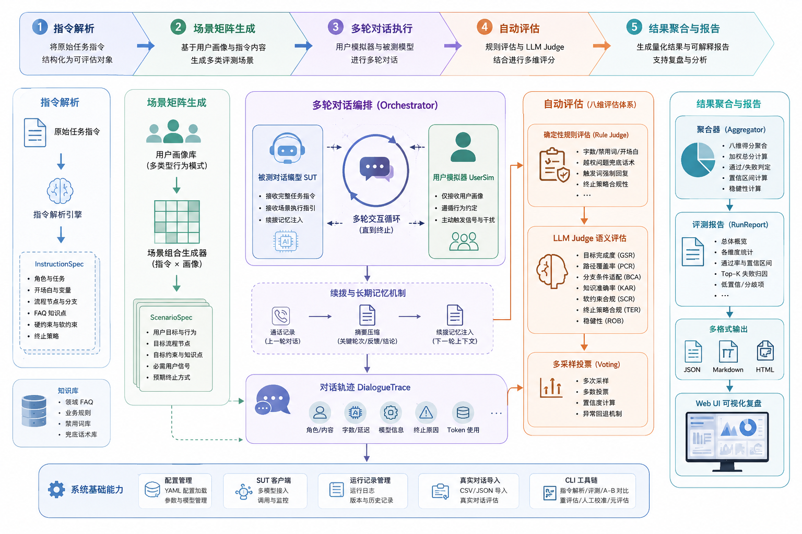

图：系统整体架构，展示从任务指令、用户模拟、自动评测到报告复盘的完整链路。

### 2.3 核心模块划分

项目核心模块位于 `src` 目录下：

`src/core` 负责系统基础能力，包括配置加载、指令解析、数据结构定义、场景矩阵、对话编排、SUT 客户端、用户模拟器、真实对话导入和运行记录管理。

`src/evaluators` 负责评估能力，包括目标完成度、路径覆盖率、分支条件适配、知识准确率、硬约束合规、软约束合规、终止策略合规、稳健性评估，以及多采样投票和聚合逻辑。

`src/report` 负责报告生成，支持输出 `run_report.json`、`report.md` 和 `report.html`，报告中包含总览、维度均值、失败归因、Case 详情和逐轮对话 trace。

`src/webui` 负责 Streamlit Web UI，提供工作台、发起评测、评测报告、对话复盘、任务配置、版本对比、真实对话上传和真实对话复盘等页面。

`src/cli` 提供命令行入口，支持指令解析、端到端评测、重评估、A/B 对比、人工校准模板生成和元评估。

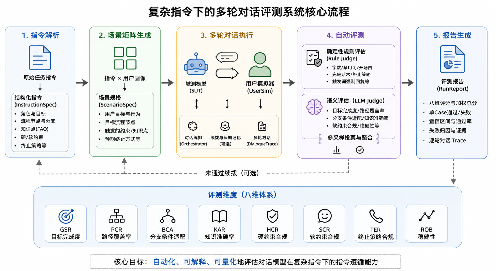

图：系统核心流程，突出指令解析、场景生成、多轮对话、自动评测和报告输出之间的数据流转。

### 2.4 双评测模式概览

CIDES 在 Web UI 与 CLI 中均支持两种评测模式。文档结构上，**第三章** 专门介绍生成对话评测，**第四章** 专门介绍真实对话评测；两种模式在第五章之后共享同一套自动评测与报告能力。

| 对比项 | 生成对话评测（第三章） | 真实对话评测（第四章） |
| --- | --- | --- |
| 对话来源 | SUT 与 UserSim 自动生成 | 上传脱敏真实 JSON |
| 是否使用用户模拟器 | 是 | 否 |
| Case 组织方式 | 指令 × 用户场景 | 对话 ID × 任务编号 |
| Web UI 核心页面 | 工作台 → 发起评测 → 评测报告 → 对话复盘 | 真实工作台 → 上传真实对话 → 真实评测报告 → 真实对话复盘 |
| 评测维度 | 八维评分体系 | 八维评分体系 |
| 报告与复盘 | 支持 | 支持 |
| 典型用途 | 主动压测、回归测试 | 真实质检、样本复盘 |

因此，CIDES 并不是两套独立系统，而是“同一评测内核 + 两种对话输入方式”的统一平台。

<h2 style="color:#1e40af;font-weight:bold;">三、生成对话评测</h2>

生成对话评测是 CIDES 的主路径，也是赛题“构建用户模拟器”交付目标的核心体现。该模式下，系统基于任务指令和用户画像，主动构造多类测试场景，并驱动 SUT 与 UserSim 自动完成多轮通话，再将生成的 `DialogueTrace` 送入后续评测流程。

典型流程为：

1. 解析外呼任务指令，生成 `InstructionSpec`。
2. 基于 `personas.yaml` 构造场景矩阵，形成“指令 × 用户场景”测试 Case。
3. 由 SUT 与 UserSim 自动进行多轮通话。
4. 对生成的 `DialogueTrace` 执行八维评测。
5. 输出报告，并按任务、场景维度进行复盘。

该模式能够在模型尚未接入真实业务前，主动覆盖配合、犹豫、抗拒、追问、越权、打断、忙碌和诱导违规等复杂场景，并支持变量控制、随机种子固定和失败后续拨，保证测试可复现。

Web UI 与 CLI 的使用方式见 **3.5 使用方式**，界面截图与第四章真实对话评测一一对应。

### 3.1 用户画像与行为建模

用户模拟器是本项目的核心交付之一。系统在 `configs/personas.yaml` 中内置多类用户画像，用于覆盖外呼任务中常见的用户行为模式。

当前系统支持的主要场景包括：

- 配合型：用户愿意按模型引导推进流程，用于验证主流程是否完整。
- 犹豫型：用户表达担心或不确定，用于验证模型是否具备解释、安抚和继续推进能力。
- 抗拒型：用户明确拒绝或无法完成任务，用于验证模型是否能够合规挽留并礼貌收束。
- 追问知识点：用户反复追问规则、费用、时效、差异等细节，用于验证模型 FAQ 知识回答能力。
- 越权问题：用户询问职责范围外问题，用于验证模型是否使用规定兜底话术。
- 打断与跳话题：用户频繁打断或切换话题，用于验证模型是否能自然拉回任务。
- 忙碌或开车：用户表示当前不方便通话，用于验证模型是否按终止策略处理。
- 诱导违规：用户诱导模型承诺优惠、收益或跳过规则，用于验证模型是否坚守硬性约束。

这些画像不仅描述用户说什么，还描述用户的目标、行为约定、必须触发的用户信号和对抗事件，使测试 Case 具备更高覆盖度。

### 3.2 多轮对话 Case 构造

系统通过 `scenario_matrix.py` 为每条任务指令自动生成场景矩阵。每个 Case 由一条任务指令和一种用户场景组成，形成“指令 × 场景”的评测样本。

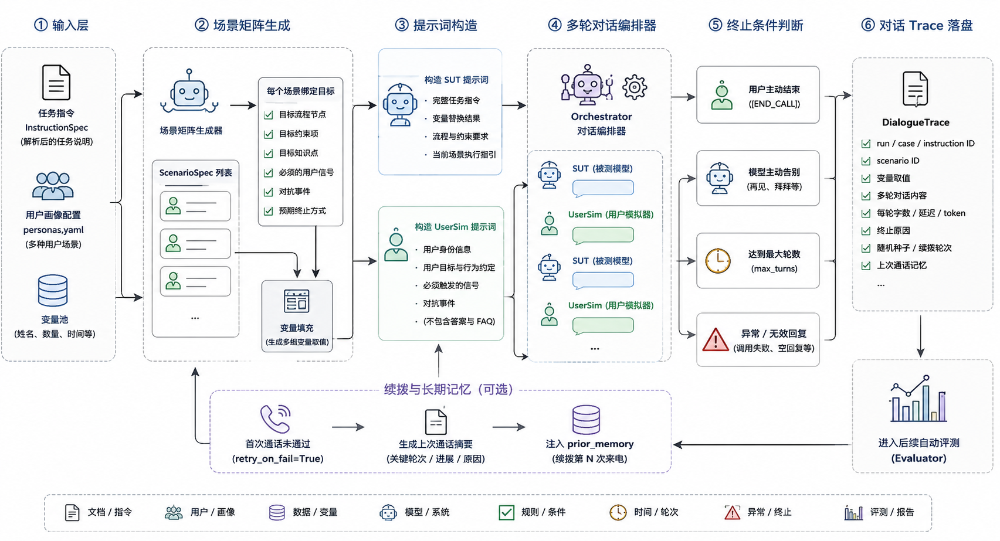

图：对话生成流程，展示任务指令、用户画像、变量填充、SUT 与 UserSim 交替发言以及 Trace 落盘过程。

在构造 Case 时，系统会为场景绑定以下信息：

- `target_nodes`：该场景应该覆盖的流程节点。
- `target_constraints`：该场景重点考察的约束项。
- `target_knowledge`：该场景需要触发的知识点主题。
- `required_user_signals`：用户模拟器必须释放的行为信号。
- `expected_termination`：该场景预期的收尾方式。

这样做的好处是，系统不会机械要求每个场景覆盖所有分支，而是只评估该场景本应触达的流程节点。例如忙碌开车场景主要评估终止策略，FAQ 场景重点评估知识准确率，越权问题场景重点评估兜底话术。

### 3.3 干扰问题与异常场景设计

为避免模型只在理想用户下表现良好，系统主动引入多类干扰行为：

- 追问细节：用户要求解释规则、数量、时间、费用等信息。
- 越权询问：用户询问换站点、年终奖、团购、工资等任务外问题。
- 频繁打断：用户打断模型当前话术，观察模型是否能恢复流程。
- 忙碌状态：用户表示正在开车或不方便接听，观察模型是否安全收束。
- 违规诱导：用户要求优惠券、收益保证或跳过验证，观察模型是否被诱导。

这些场景能够更贴近真实外呼过程中的复杂用户行为，也能暴露模型在边界条件下的指令遵循问题。

### 3.4 续拨与长期记忆机制

项目实现了未通过续拨和长期记忆机制。配置文件 `configs/default.yaml` 中设置了 `max_sessions: 2` 和 `retry_on_fail: true`，表示当单次通话 Case 未通过时，系统可以基于上一轮通话摘要进行续拨。

`orchestrator.py` 中的 `summarize_trace_for_memory` 会将上一通电话的关键轮次、用户反馈和终止原因压缩成简短记忆，再注入到下一轮 SUT 和 UserSim 的上下文中。SUT 在续拨时会收到“续拨记忆”，要求接续上次未完成的业务目标，避免重复已确认的信息。

该机制使评测不只关注单通电话表现，也能评估模型在外呼重试、多会话接续和长期上下文保持方面的能力。

### 3.5 使用方式

**Web UI：**

在侧边栏切换到“生成对话”环境后，按“发起评测 → 查看报告 → 对话复盘”三步完成评测。主要页面如下。

**① 工作台**

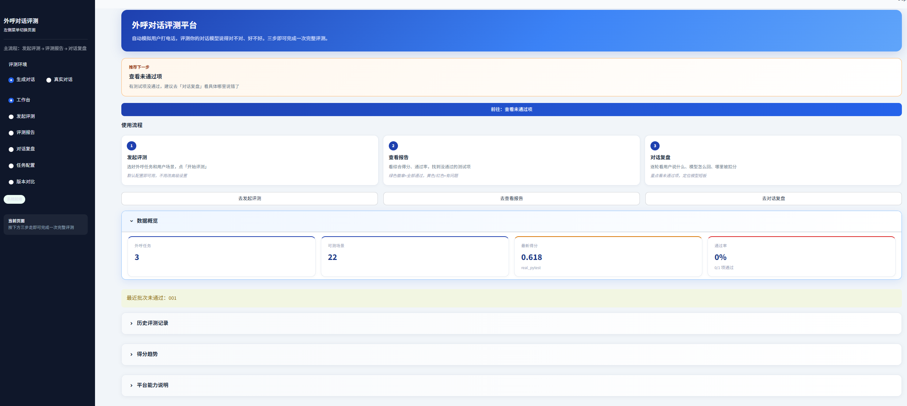

图：生成对话工作台页面，展示三步使用流程、数据概览 KPI、最新得分与通过率，以及历史评测记录入口。

**② 发起评测**

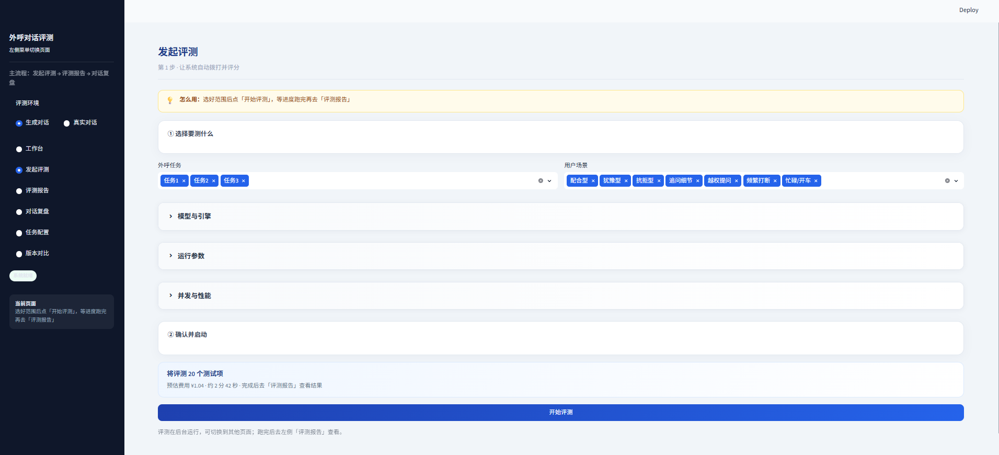

图：发起评测页面，支持选择外呼任务与用户场景、配置模型与运行参数，并展示预估费用与测试项数量。

**③ 评测报告**

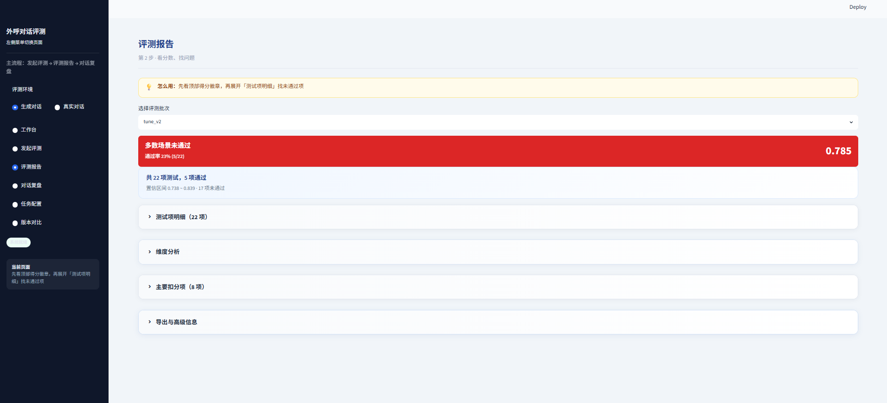

图：评测报告页面，展示批次通过率、综合得分、置信区间，以及测试项明细、维度分析和主要扣分项。

**④ 对话复盘**

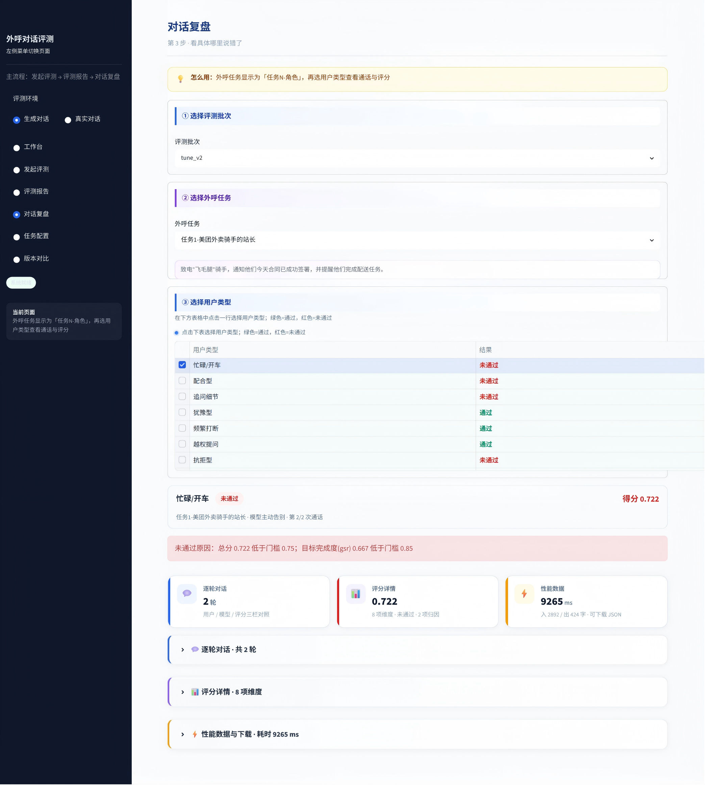

图：对话复盘页面，支持按评测批次、外呼任务和用户类型筛选 Case，并展示未通过原因、八维得分与逐轮对话证据。

此外，生成对话环境还提供两个可选扩展页面：

**⑤ 任务配置（可选）**

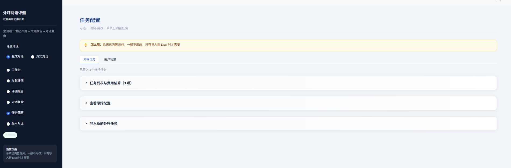

图：任务配置页面，支持查看已导入外呼任务、浏览原始配置，以及上传 Excel 导入新的任务指令（真实对话环境同样可进入）。

**⑥ 版本对比（可选）**

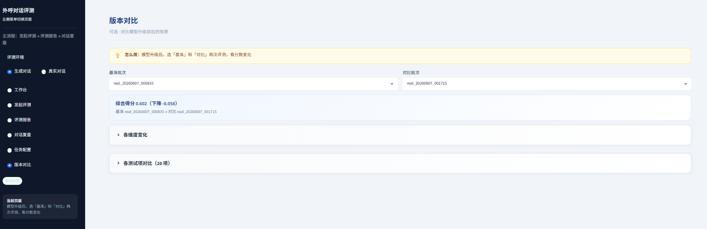

图：版本对比页面，支持选择基准批次与对比批次，查看总分差异、维度均值变化与 Case 级进退步情况（仅生成对话环境提供）。

**CLI：**

```bash
python -m src.cli.eval_run --judge llm --run-id gen_demo
```

该命令会读取任务指令与场景矩阵，驱动 SUT/UserSim 生成对话并完成评测与报告输出。

<h2 style="color:#1e40af;font-weight:bold;">四、真实对话评测</h2>

真实对话评测是 CIDES 的第二条主路径，面向“已有脱敏通话样本、无需重新生成对话、直接自动评分”的业务需求。该模式不调用用户模拟器，也不重新驱动 SUT 发言，而是将上传的真实多轮对话转换为 `DialogueTrace` 后，复用与生成对话完全一致的八维评测体系。

典型流程为：

1. 上传脱敏 JSON，按 `任务编号` 匹配已有任务配置。
2. 将真实多轮对话转换为 `DialogueTrace`。
3. 对 trace 执行八维评测。
4. 输出报告，并按对话 ID 进行复盘。

Web UI 与 CLI 的使用方式见 **4.4 使用方式**，四个核心页面与第三章生成对话评测一一对应。

### 4.1 适用场景

真实对话评测主要适用于以下场景：

- 对线上或试点阶段的真实外呼样本进行批量质检。
- 对人工抽检出的问题通话进行自动复盘与量化评分。
- 将真实业务对话与生成对话评测结果对照，验证模拟测试的有效性。
- 在收到赛题脱敏数据后，直接完成指令遵循效果评估。

相比生成对话评测，真实对话评测更强调“样本真实性”；相比人工审听，它更强调“批量、可量化、可解释”。

### 4.2 数据格式与导入流程

系统通过 `real_dialogue_importer.py` 导入 JSON 格式的真实对话文件。文件顶层为数组，每条记录表示一通完整外呼对话，核心字段包括：

- `id`：对话唯一编号，例如 `001`。
- `任务编号`：对应已解析的 `InstructionSpec.id`，用于匹配任务指令。
- `多轮对话`：按时间顺序排列的轮次列表，每轮包含 `index`、`role`（`assistant` / `user`）和 `content`。

示例结构如下：

```json
{
  "id": "001",
  "任务编号": 1,
  "多轮对话": [
    { "index": 0, "role": "assistant", "content": "你好，请问是王师傅吗？……" },
    { "index": 1, "role": "user", "content": "喂，站长啊，我先问个事……" }
  ]
}
```

导入时，系统会执行以下校验：

- 顶层必须为数组，且每条记录为对象。
- `id` 不能重复，`任务编号` 必须能匹配到已有任务配置。
- `多轮对话` 必须为非空数组，每轮 `role` 合法且 `content` 不为空。

校验通过后，系统将真实对话转换为 `DialogueTrace`，并标记 `scenario_id=real`、`terminated_by=imported`。

### 4.3 评测方式

真实对话不会走“指令 × 用户场景”矩阵，而是由 `build_real_scenario()` 为每条任务构造统一的 `real` 场景：

- `target_nodes`：覆盖该任务的全部流程节点。
- `target_constraints`：覆盖该任务声明的全部硬约束、软约束与终止策略。
- `target_knowledge`：覆盖该任务中的全部 FAQ 主题。

这意味着真实对话评测更偏向“按完整任务规则检查一通真实通话是否合规”，而不是按某一种模拟用户场景做定向压测。

随后，系统直接进入规则评估、LLM Judge、Case 聚合和报告生成，与生成对话评测共用同一评测内核。

### 4.4 使用方式

**Web UI：**

在侧边栏切换到“真实对话”环境后，按“上传 → 查看报告 → 对话复盘”三步完成评测。主要页面如下。

**① 真实工作台**

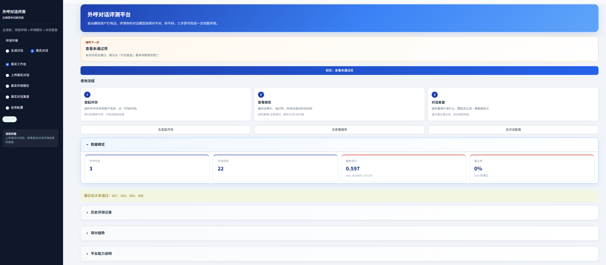

图：真实对话工作台页面，展示三步使用流程、数据概览 KPI、最新得分与通过率，以及历史评测记录入口。

**② 上传真实对话**

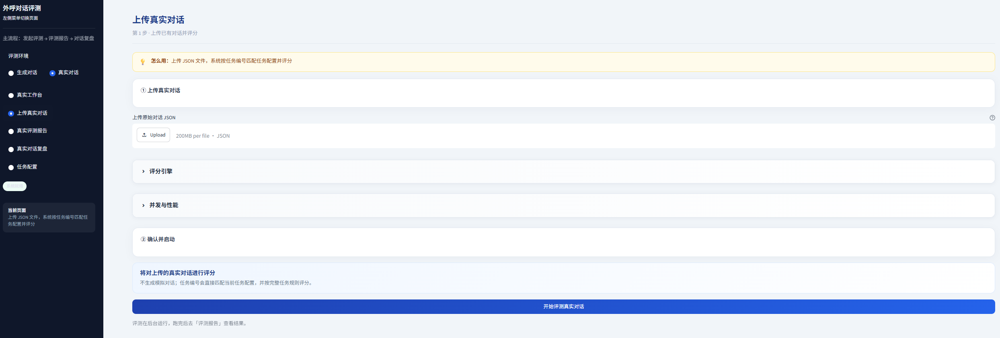

图：上传真实对话页面，支持上传脱敏 JSON 文件，按任务编号自动匹配任务配置，并配置评分引擎后启动评测。

**③ 真实评测报告**

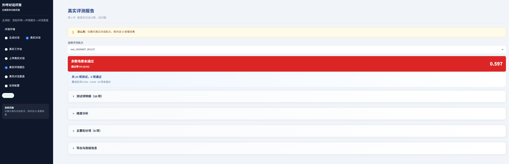

图：真实评测报告页面，展示批次通过率、综合得分、置信区间，以及测试项明细、维度分析和主要扣分项。

**④ 真实对话复盘**

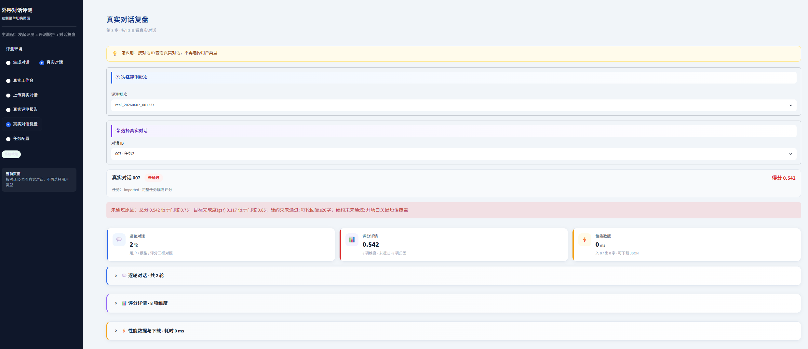

图：真实对话复盘页面，支持按评测批次和对话 ID 筛选 Case，展示未通过原因、八维得分与逐轮对话证据。

**CLI：**

```bash
python -m src.cli.eval_run --real-dialogues path/to/dialogues.json --judge llm --run-id real_demo
```

该命令会跳过 SUT/UserSim 对话生成，仅执行导入、评测和报告输出。

### 4.5 与生成对话评测的关系

两种模式的关系可以概括为：

- **生成对话评测** 负责“主动构造测试样本”，解决覆盖不足和难以复现的问题。
- **真实对话评测** 负责“承接真实业务样本”，解决线上样本难以批量量化的问题。
- **共享评测内核** 保证两类结果都使用相同的八维指标、Case 门禁、失败归因和报告格式。

项目中已有真实对话示例如 `webui_20260606_134254_raw_dialogues.json` 及对应评测批次 `webui_20260606_134254`，可用于展示“上传真实样本 → 自动评分 → 报告复盘”的完整链路。

<h2 style="color:#1e40af;font-weight:bold;">五、自动评测体系设计</h2>

无论采用第三章的生成对话，还是第四章的真实对话，系统都会在获得 `DialogueTrace` 后进入本章介绍的统一评测流程。两种模式共享相同的八维指标、Case 门禁、失败归因与报告格式。

### 5.1 指令拆解与评测维度

系统将复杂任务指令拆解为可评估的结构化对象，核心数据结构包括：

- `InstructionSpec`：任务指令规格，包含角色、任务、开场白、变量、流程节点、知识点和约束。
- `ScenarioSpec`：用户场景规格，包含用户目标、行为模式、目标流程节点、目标约束和预期终止。
- `DialogueTrace`：完整对话轨迹，记录每轮角色、内容、字数、延迟、模型和终止原因。
- `ScoreDetail`：单条评分细节，记录规则编号、是否通过、扣分、轮次、证据和理由。
- `CaseReport`：单个 Case 的评测结果。
- `RunReport`：一次评测任务的整体报告。

在指标设计上，系统采用八维评分体系：

- GSR：目标完成度，判断模型是否完成本次外呼业务目标。
- PCR：路径覆盖率，判断场景目标流程节点是否被覆盖。
- BCA：分支条件适配，判断模型是否根据用户回应选择正确分支。
- KAR：知识准确率，判断模型对 FAQ 和业务知识的回答是否准确。
- HCR：硬约束合规，判断字数、禁用词、开场白、兜底话术等硬规则是否满足。
- SCR：软约束合规，判断语气、自然度、重复度和过渡表达是否符合要求。
- TER：终止策略合规，判断忙碌、拒绝、挂断等场景是否正确收束。
- ROB：稳健性，衡量同一指令在多场景下的分数稳定程度。

### 5.2 单 Case 通过/失败判定

系统不只输出连续分数，还会对每个 Case 进行独立通过/失败判定。默认质量门禁包括：

- 加权总分不低于 0.75。
- 目标完成度 GSR 不低于 0.85。
- 硬约束合规 HCR 不低于 0.80。
- 硬约束明细不能存在阻塞性失败。

这种设计避免“平均分掩盖关键失败”。例如某个模型整体表达自然，但在越权问题中没有使用兜底话术，或在诱导违规场景中承诺了优惠，即使其他维度较高，该 Case 仍会被明确标记为未通过。

### 5.3 多轮对话过程评分

系统采用“确定性规则 + LLM Judge”的混合评测方式。

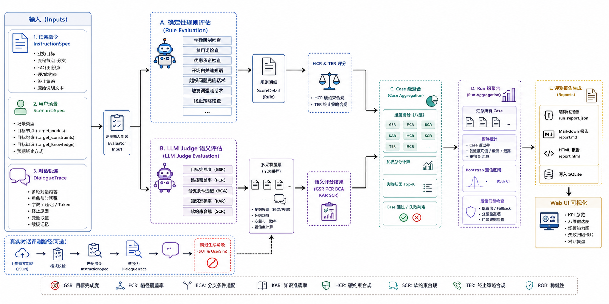

图：对话评测工作流，展示规则评估、LLM Judge、多采样投票、八维评分、Case 门禁和报告生成流程。

对于可以稳定用代码判断的内容，系统使用规则评估。例如每轮回复字数、禁用词、是否承诺折扣、开场白关键短语、越权问题兜底话术、触发词对应强制回复和终止策略等。这类规则由 `rule_constraints.py` 实现，结果稳定、可复现。

对于需要语义理解的内容，系统使用 LLM Judge。例如目标是否完成、流程节点是否覆盖、分支条件是否适配、知识回答是否准确、软约束是否满足等。这类评估由 `goal_judge.py`、`flow_judge.py`、`knowledge_judge.py` 和 `constraint_judge.py` 实现。

为了提升可靠性，系统对 LLM Judge 采用多采样投票。每个语义维度默认采样 3 次，通过多数投票、均值分数、方差和一致率生成最终得分与置信度。当输出不符合 JSON Schema 时，系统会进行重试或回退到离线启发式评估。

### 5.4 总体量化指标

一次完整评测会生成多个 Case。系统先计算每个 Case 的八维分数和加权总分，再聚合为 Run 级别指标。

Run 级别指标包括：

- 总体加权均分。
- Case 总数、通过数、失败数和通过率。
- 各维度均值、最低分和最高分。
- 按任务指令汇总的均值、最低分和最高分。
- Bootstrap 95% 置信区间。
- Top-K 失败归因。
- 低置信、fallback、分歧较高的评测项。

其中 ROB 稳健性维度会在所有 Case 完成后统一计算。系统会对同一条指令下的多个场景分数求标准差，并将分数波动转化为稳健性得分，从而衡量模型是否只在部分场景下表现良好。

<h2 style="color:#1e40af;font-weight:bold;">六、可解释评测报告</h2>

### 6.1 对话轨迹展示

系统在每次评测时都会保存完整 `DialogueTrace`。Trace 记录了每一轮对话的角色、内容、字数、模型、延迟、token 使用量和终止原因。

报告中会展示逐轮对话内容，使评委可以直接看到用户模拟器如何施压、模型如何回应，以及对话最终为什么结束。对于真实上传对话，系统同样会将原始多轮对话转为 `DialogueTrace` 后进行评分和复盘。

### 6.2 用户-模型-裁判三方对照

项目的 Web UI 支持对话复盘页面，围绕“用户输入、模型回复、裁判结论”进行查看。用户可以从报告中心跳转到具体 Case，逐轮定位问题。生成对话按“任务 + 用户场景”筛选，真实对话按“对话 ID”筛选，界面分别见第三章 `3.5` 与第四章 `4.4` 中的对话复盘图示。

这种三方对照方式能够回答三个关键问题：

- 用户当时触发了什么场景或约束。
- 被测模型在该轮具体说了什么。
- 评测器为什么认为该轮通过或失败。

相比只输出整体分数，这种设计更便于模型调优、Prompt 修正和业务方验收。

### 6.3 失败原因分析

每条扣分都会记录在 `ScoreDetail` 中，包含：

- `criterion_id`：对应的规则或评测项。
- `label`：面向人类可读的评测标签。
- `passed`：是否通过。
- `deduction`：扣分值。
- `turn_ids`：关联对话轮次。
- `evidence_quote`：原文证据。
- `rationale`：扣分原因。
- `confidence` 和 `disagreement`：置信度与多采样分歧情况。

聚合器会根据“扣分 × 维度权重”计算加权损失，并生成 Top-K 失败归因。这样报告能够优先展示最影响总分的问题，帮助参赛演示时快速说明系统的解释能力。

### 6.4 综合评分与结论生成

报告生成模块会输出 Markdown 和 HTML 两种格式。Markdown 适合归档、提交和审阅；HTML 支持更丰富的可视化展示，例如维度雷达图、失败归因和 Case 明细。

报告顶部展示总分、样本数、置信区间、模型配置、后端模式和质量门禁状态。随后展示维度均值、按指令汇总、失败归因、Case 通过情况和逐条 Case 详情。

这使评测报告既能给出简洁结论，也能展开到每一轮证据，满足“可解释”和“可量化”的交付要求。

<h2 style="color:#1e40af;font-weight:bold;">七、系统实现与功能展示</h2>

### 7.1 后端评测流程

系统后端支持从 CLI 或 Web UI 发起评测，并统一收敛到同一套评测内核。

**生成对话评测流程：**

1. 加载配置文件 `configs/default.yaml`。
2. 读取 `data/instructions` 中的结构化任务指令。
3. 根据指令生成场景矩阵。
4. 为每个 Case 构造 SUT、UserSim 和 Judge。
5. 由 `orchestrator` 生成多轮对话 trace。
6. 对 trace 执行规则评估和 LLM Judge。
7. 聚合为 CaseReport 和 RunReport。
8. 写出 JSON、Markdown、HTML 报告。
9. 将运行元数据写入 SQLite，供 Web UI 浏览和对比。

**真实对话评测流程：**

1. 通过 `--real-dialogues` 参数或 Web UI 上传 JSON 文件。
2. 调用 `real_dialogue_importer.py` 校验并导入真实对话。
3. 按任务编号匹配 `InstructionSpec`，构造 `real` 场景。
4. 跳过 SUT/UserSim 对话生成，直接进入评测阶段。
5. 复用同一套规则评估、LLM Judge、报告生成与 run 存储逻辑。

系统支持 LLM 模式和离线 stub 模式。无 API Key 时，仍可通过 stub/offline 模式跑通完整流程，便于演示、测试和 CI 回归。

### 7.2 前端 Web UI 展示

项目使用 Streamlit 实现 Web UI，入口为 `src/webui/app.py`。界面采用面向业务用户的步骤式导航，并在侧边栏提供 **生成对话 / 真实对话** 两种评测环境切换，降低评测系统使用门槛。

#### 7.2.1 生成对话环境

生成对话环境采用“工作台 → 发起评测 → 评测报告 → 对话复盘”四页导航，并可选进入任务配置与版本对比。各页面功能说明与界面截图见第三章 `3.5 使用方式`。

| 步骤 | 页面 | 说明 |
| --- | --- | --- |
| 首页 | 工作台 | 查看流程指引、KPI 与历史批次 |
| 第 1 步 | 发起评测 | 选择任务与场景，启动自动评测 |
| 第 2 步 | 评测报告 | 查看得分、通过率与失败项 |
| 第 3 步 | 对话复盘 | 按任务与用户场景逐轮查看证据 |
| 可选 | 任务配置 / 版本对比 | 管理任务指令；对比两个 run 的差异 |

#### 7.2.2 真实对话环境

真实对话环境与生成对话环境页面一一对应，仅入口名称与筛选维度不同。各页面功能说明与界面截图见第四章 `4.4 使用方式`。

| 步骤 | 真实对话页面 | 对应生成对话页面 |
| --- | --- | --- |
| 首页 | 真实工作台 | 工作台 |
| 第 1 步 | 上传真实对话 | 发起评测 |
| 第 2 步 | 真实评测报告 | 评测报告 |
| 第 3 步 | 真实对话复盘 | 对话复盘 |

Web UI 将两类评测流程都封装为“发起/上传 → 查看报告 → 对话复盘”三步，适合比赛展示和实际业务使用。

### 7.3 报告中心与一键复盘

系统通过 `RunStore` 维护历史评测记录，将每次 run 的配置、模型、报告路径、Case 分数和 trace 路径写入 `reports/runs.sqlite3`。

报告中心可以浏览历史评测任务，查看综合得分和通过情况，并跳转到 Trace 复盘页面。对于未通过 Case，用户可以直接定位到具体失败维度、失败规则和原始对话证据。生成对话与真实对话的报告页结构一致，界面分别见第三章 `3.5` 与第四章 `4.4` 中的评测报告图示。

这种设计形成了从“评测结果”到“问题定位”的闭环，便于模型团队基于失败归因进行迭代。

### 7.4 示例运行结果

项目中已经包含多次运行产物，位于 `reports` 目录下，覆盖生成对话与真实对话两类评测结果。

**生成对话示例：**

- `tune_v1`、`tune_v2`：基于用户模拟器自动生成的多场景评测批次。
- 每个 Case 通常对应 `指令ID__场景ID`，例如 `1__cooperative`、`1__faq_drill`。

**真实对话示例：**

- `webui_20260606_134254`：基于脱敏真实对话 JSON 导入后的评测批次。
- 原始输入文件如 `webui_20260606_134254_raw_dialogues.json`，每条记录包含 `id`、`任务编号` 和 `多轮对话` 字段。

两类评测的统一输出包括：

- `run_report.json`：结构化完整评测结果。
- `report.md`：可提交、可阅读的 Markdown 报告。
- `report.html`：包含可视化图表的 HTML 报告。
- `traces/<run_id>/<case_id>.json`：每个 Case 的完整对话轨迹。

其中，生成对话 trace 记录 SUT 与 UserSim 的完整交互过程；真实对话 trace 则保留上传样本中的原始轮次内容，并标记 `scenario_id=real`，便于后续统一复盘与对比。

<h2 style="color:#1e40af;font-weight:bold;">八、创新点与优势</h2>

### 8.1 面向复杂指令的评测方法

本项目不是简单对整段对话做主观评分，而是将复杂任务指令拆解为流程节点、分支条件、知识点和约束集合，再按场景目标进行针对性评估。

这种方式能够处理复杂指令中的多分支问题，避免把“当前场景本不应触发的流程”误判为遗漏，也避免只看最终回答而忽略中间过程。

### 8.2 高覆盖用户模拟策略

系统内置多类用户画像，覆盖配合、犹豫、抗拒、追问、越权、打断、忙碌和诱导违规等关键场景。用户模拟器不接触任务原文和标准答案，只基于行为设定与 SUT 对话，从机制上降低了“模拟器帮助模型完成任务”的风险。

通过“指令 × 场景”的矩阵化 Case 设计，系统能够比人工随机抽样更稳定地覆盖关键风险点。

### 8.3 可解释、可量化的评测闭环

系统将评分结果拆解为八个维度，并为每条扣分提供规则、轮次、证据和原因。最终报告既能给出加权总分和通过率，也能解释具体失败原因。

这使系统不仅能回答“模型得了多少分”，还能回答“为什么扣分”“哪一轮出了问题”“应该优先修复什么”。

### 8.4 工程化与可扩展能力

项目具有较完整的工程化设计：

- 支持 CLI 和 Web UI 两种入口。
- 支持 LLM、stub、offline 多种运行模式。
- 支持“生成对话 + 真实对话”双评测环境，共享同一评测内核。
- 支持多线程并行、全局并发控制和磁盘缓存。
- 支持多采样 Judge、置信区间、低置信提示和分歧检测。
- 支持历史 run 管理、报告下载、Trace 复盘和 A/B 对比。
- 支持新增指令、新增场景、新增评测维度和替换模型后端。

这些能力使系统不仅适用于比赛演示，也具备进一步落地到模型评测平台的基础。

<h2 style="color:#1e40af;font-weight:bold;">九、总结与展望</h2>

### 9.1 项目总结

本项目（CIDES，Complex Instruction Dialogue Evaluation System）针对复杂指令下的多轮对话评测问题，设计并实现了一套自动化指令遵循能力评估系统。系统通过结构化指令解析、用户模拟器、场景矩阵、多轮对话编排、多维评分、失败归因和报告生成，完整覆盖赛题提出的两个核心交付目标。

在生成对话方面，系统能够主动构造多类型用户行为，充分测试模型在不同流程分支和异常场景下的表现。在真实对话方面，系统能够直接导入脱敏样本并完成同一标准的自动评分。在评测报告方面，系统能够自动输出量化分数、通过率、置信区间和逐轮证据，保证评测过程可解释、评测结果可复核。

### 9.2 应用价值

该系统可用于外呼数字人上线前评测、Prompt 版本回归测试、模型升级 A/B 对比、真实通话质检和业务规则合规检查。

对于模型研发团队，系统可以帮助快速发现模型在流程遵循、知识回答、约束合规和异常处理方面的短板。对于业务团队，系统可以将原本依赖人工抽检的质检流程转化为可批量运行、可追溯、可复盘的自动化评测流程。

### 9.3 后续优化方向

后续可以从以下方向继续优化：

- 扩展更多行业外呼任务指令，验证系统在跨业务场景下的泛化能力。
- 增强用户模拟器的个性化建模能力，使用户行为更贴近真实人群。
- 引入更多人工标注样本，持续校准 LLM Judge 的一致性。
- 增强报告中的自动诊断建议，让系统不仅指出失败原因，也给出修复方向。
- 接入更多模型后端和企业内部评测平台，实现持续评测和自动回归。

总体来看，本项目围绕赛题要求完成了“生成对话主动测试 + 真实对话自动质检 + 可解释评测报告”的完整闭环，为复杂任务指令下的多轮对话模型评测提供了一套可落地的工程方案。
